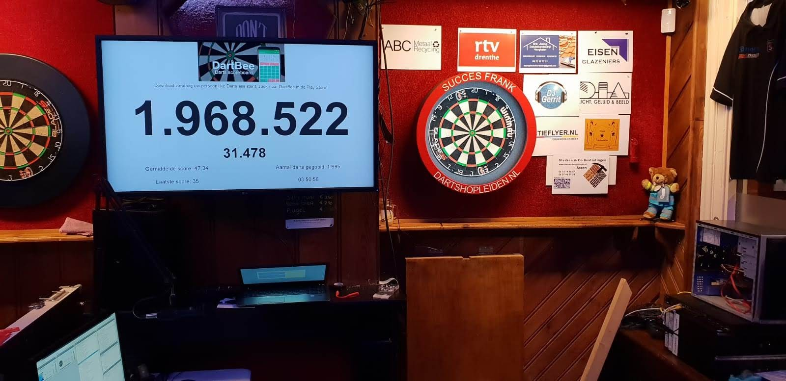
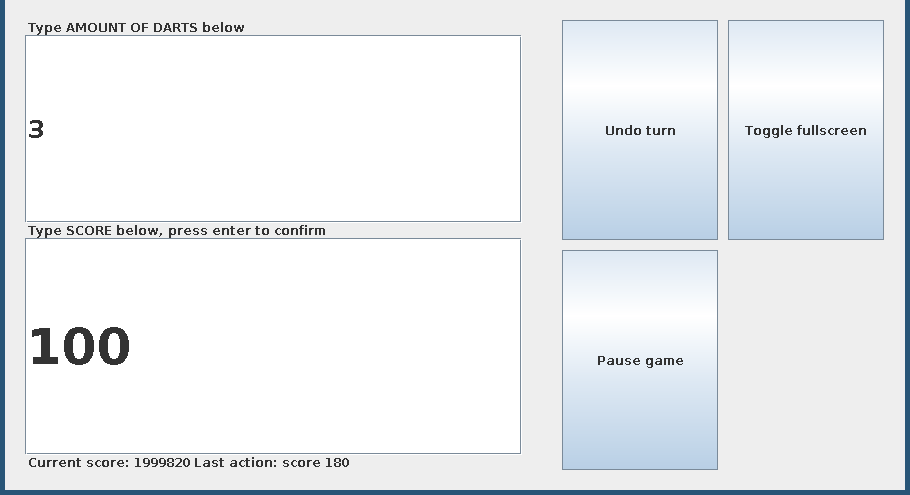

# WRDartBee
This application was used for the a world record attempt to beat the longest darts marathon. Starting on 05-11-2018, Frank Posthumus played darts for 65 hours and 20 minutes, with only five minute breaks every hour. 

The score goal of 2 million points was never reached, but the time goal of 60 hours was easily reached.
More information (in dutch) here:

https://www.rtvdrenthe.nl/nieuws/139529/Wereldrecord-Frank-Posthumus-dart-ruim-zestig-uur-non-stop

https://www.ad.nl/binnenland/frank-37-wil-record-darten-verbreken-moet-minstens-30-000-keer-gooien~acb0d75a/

**The program**

When the application is in use, it shows 2 windows. One window, called the DisplayScreen, is used to show the score to all spectators. It also shows some statistics, like the average score, amount of darts thrown, etc. The other window, called the ControllerScreen, is operated by the score counter. This windows contains all the controls to enter new scores and to pause/resume the game. It is never visible to spectators.

**Saving data**

Due to the nature of the program, it is of utmost importance that the darts data is always saved, even in the event of a power outage. To achieve this, the program writes its state to a file after every input. This file is the dartlog, and is a txt file containing all information. This file can be reopened, to resume a game on its last state when needed. 

**Performance**

To ensure maximum performance even with the insane amount of darts involved, the internals are designed to ensure O(1) time for all actions and data access, including undo's. In other words, the program does not slow down with insanely large data sizes.

**Why Java Swing + Kotlin?**

Internally, this application was written using Java Swing and Kotlin. This might seem as a weird combination, as Swing is often seen as outdated, and Kotlin is extremely modern. Swing was chosen because i think it is still extremely easy to use and straightforward. However, it has it's limitations, modern complex layouts with lots of animations are difficult to achieve. This application was never intended to have any of that though, so that was never a problem. Another drawback of Swing is the often ugly layout building code. This can be improved a lot using Kotlin, to the point of it even being quite nice. 

# Running the program
There is a release in the release section in case you want to try it. Simply download the .jar and run it!
